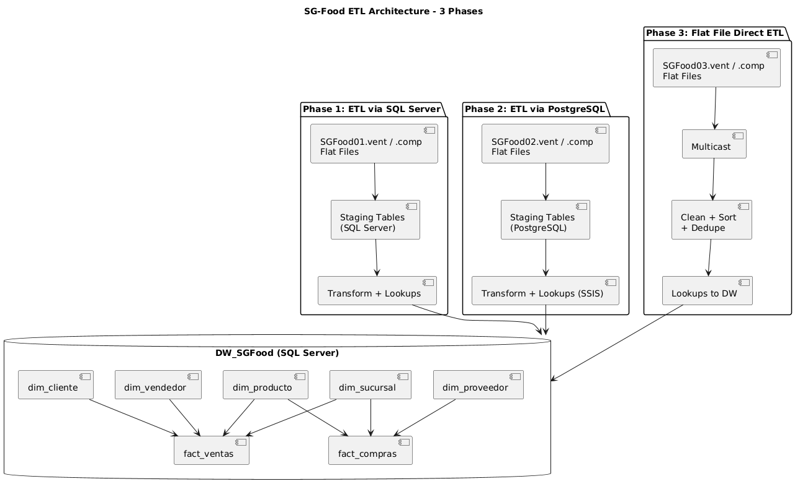
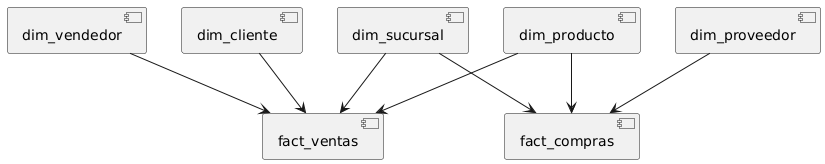

# SG-Food - Proceso ETL
Alberto Gabriel Reyes Ning \
201612174 \
Seminario de Sistemas 2 \
Proyecto Fase 1

**SG-Food - Implementación de un proceso ETL para carga y análisis de ventas y compras**

---

## Descripción de las Fases del Proceso ETL

El proyecto consta de tres fases para integrar archivos planos de ventas y compras (`.vent` y `.comp`) en un Data Warehouse centralizado:

### 🔹 Fase 1: SQL Server (Staging → DW)
- **Origen**: Archivos planos `SGFood01.vent` y `SGFood01.comp`.
- **Destino**: Tablas staging en SQL Server.
- **Transformaciones**:
  - Se realizan en SSIS (validaciones, conversiones, lookups).
  - Se insertan dimensiones (cliente, vendedor, producto, sucursal) si no existen.
  - Se carga la información a las tablas de hechos (`fact_ventas`, `fact_compras`).
  
### 🔹 Fase 2: PostgreSQL → SQL Server (ETL Híbrido)
- **Origen**: Archivos planos `SGFood02.vent` y `SGFood02.comp`.
- **Destino temporal**: Tablas staging en PostgreSQL.
- **Conexión**: Se utilizó un **ODBC Connection Manager** en SSIS (con el driver oficial de PostgreSQL).
- **Transformaciones**:
  - SSIS lee desde PostgreSQL vía ODBC.
  - Mismo flujo de transformación que en Fase 1, resultados insertados en SQL Server DW.

### 🔹 Fase 3: ETL Directo desde Archivos Planos
- **Origen**: Archivos planos `SGFood03.vent` y `SGFood03.comp`.
- **Sin staging**: SSIS extrae directamente desde los archivos planos.
- **Transformaciones**:
  - Se usa un componente `Multicast` para dividir los datos en flujos independientes.
  - Cada flujo aplica limpieza, `Sort` y `Remove Duplicates`.
  - Se hacen los `Lookups` a las dimensiones ya cargadas.
  - Se insertan directamente en `fact_ventas` y `fact_compras`.




---

## Modelo de Data Warehouse

Se implementó un **modelo en estrella** en `DW_SGFood (SQL Server)` con las siguientes tablas:

### Dimensiones:
- `dim_cliente`
- `dim_vendedor`
- `dim_producto`
- `dim_sucursal`
- `dim_proveedor`

### Hechos:
- `fact_ventas (id_fact_venta, fecha, id_cliente, id_vendedor, id_producto, id_sucursal, unidades, precio_unitario)`
- `fact_compras (id_fact_compra, fecha, id_proveedor, id_producto, id_sucursal, unidades, costo_unitario)`



### Justificación:
El modelo en estrella fue elegido por su simplicidad, velocidad en consultas analíticas y claridad en los procesos de transformación. Las claves surrogate (`id_`) permiten controlar la integridad referencial y aislar cambios en datos fuente.

---

## Manual de Implementación

### Requisitos:
- Visual Studio 2022 con SSIS instalado.
- SQL Server (cualquier edición).
- PostgreSQL (con tablas staging cargadas desde archivos planos).
- Drivers:
  - ODBC PostgreSQL Driver (`psqlodbc`).

### Pasos:
1. **Clonar el repositorio**:
   ```bash
   git clone https://github.com/Agrn96/SS2_1S2025_201612174.git
    ```

2. **Configurar instancias**:

    - Crear la base de datos DW_SGFood con el script proporcionado.

    - Crear tablas staging en SQL Server y PostgreSQL si se desea probar Fase 1 y 2 respectivamente.

3. **Editar las rutas de los archivos planos en los Flat File Connections.**

4. **Ajustar las conexiones en Connection Managers**:

    - SQL Server (OLE DB).

    - PostgreSQL (ODBC DSN o connection string directa).

5. **Ejecutar los paquetes en el orden**:

    - Load_SQL_Server → Transform_and_Load_to_DIMS → Transform_and_Load_to_DW (para Fase 1).

    - Load_Postgres → Transform_and_Load_to_DIMS_Postgres → Transform_and_Load_to_DW_Postgres (para Fase 2).

    - Transform_and_Load_No_Staging (para Fase 3).

6. **Verificar los datos**:

    - Consultar las dimensiones y hechos para validar la carga.